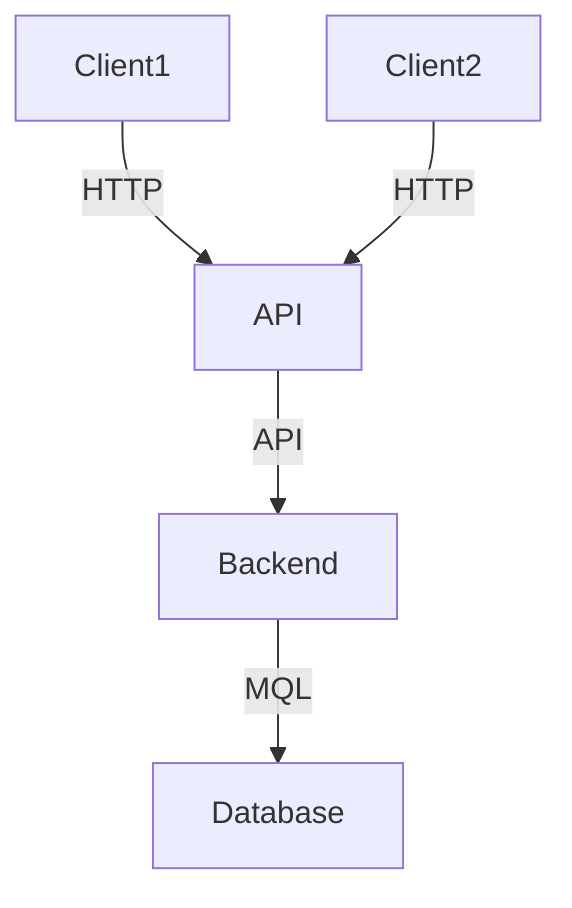

# POS SEMESTER PROJECT 2024

*Daniel Jessner 4AHINF*

The second semester of the 4AHINF of the HTL Saalfelden for computer science was dedicated to the development of a project, whereby the students were allowed to choose a suitable topic and work independently on everything from development to problem solving to detailed documentation.

My personal project is a **voting app**. What it is and what it involves is explained below:

## Voting App
The voting app is a software that allows users to create a new or log into an existing account and store **voting sessions** on that account. They can create sessions where they add their questions and answer options. After a session is safed, they can start it and give the random generated string to other people which can join this session, look at the questions and give their answers to it. In the end, the session owner ends the session and the given answers are displayed.

If you were to, you could see it as fan project of **Kahoot.it**

## Softwaredesing
The software itself comprises three areas:
- **Client (C# and XAML)**
- **Client (HTML, CSS and Javascript)**
- **Server (Java, Spring Boot)**

Each of the clients sends data to the server (API), which processes it (updating in database if needed) and sends back a corresponding response. The whole thing can be represented in the architecture as follows:

  
  
## API

  
### How to use

  
## Discussion

## Links