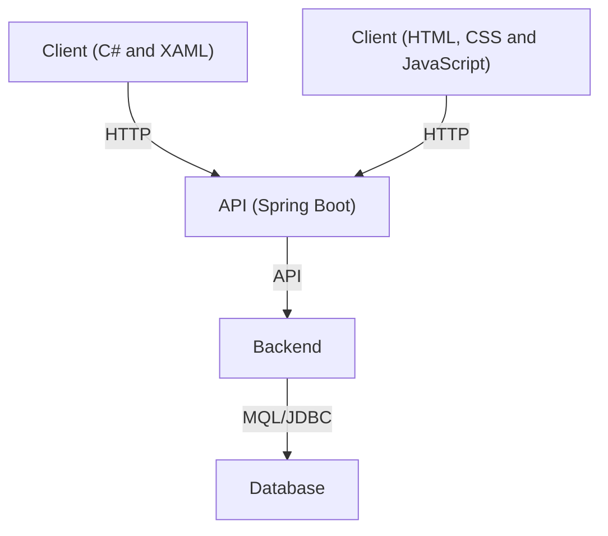
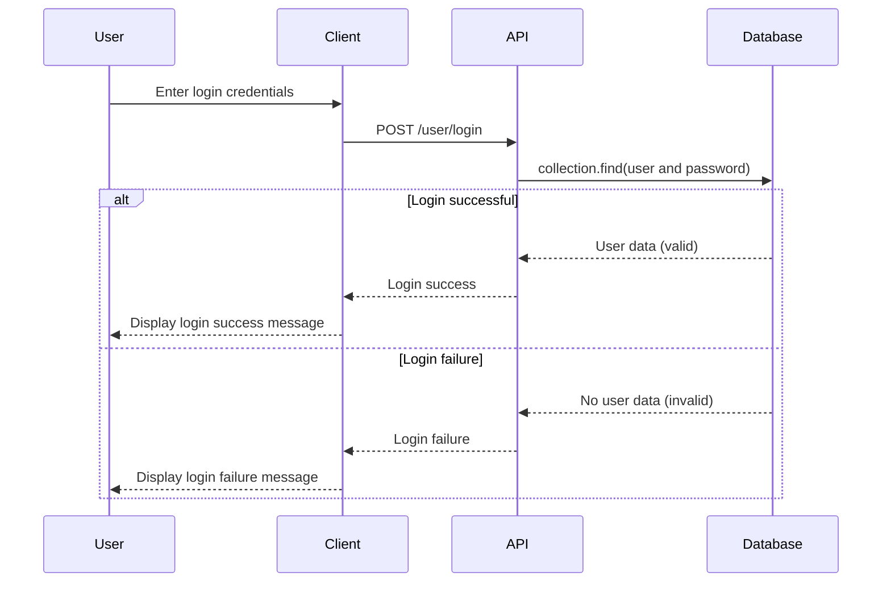
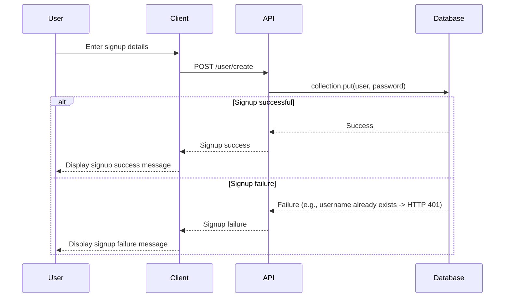
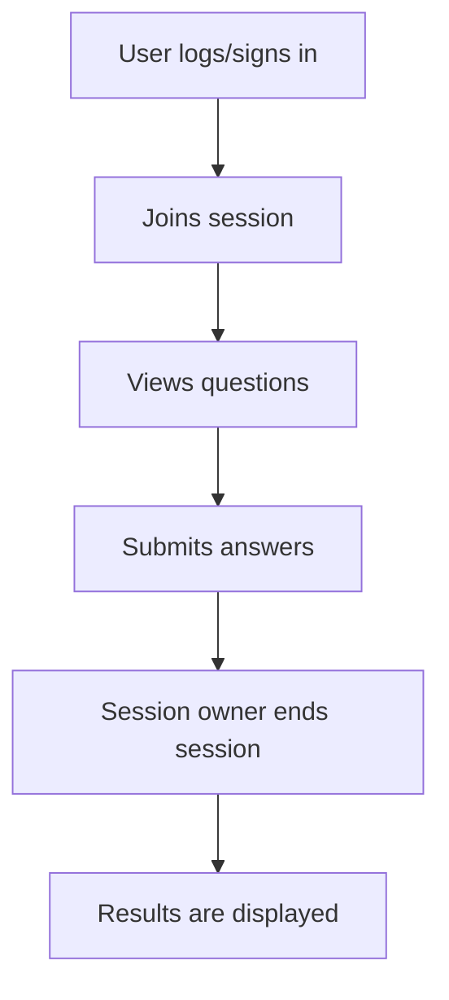
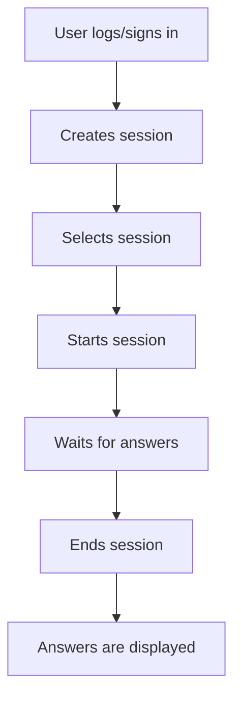
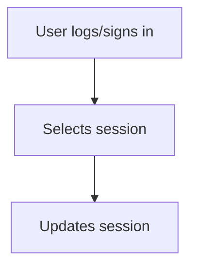
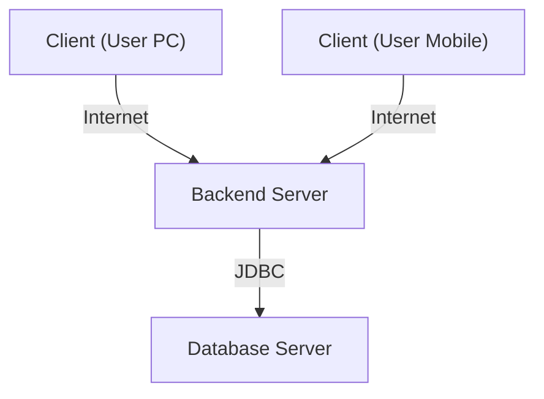

# POS SEMESTER PROJECT 2024

*Daniel Jessner 4AHINF*

The second semester of the 4AHINF of the HTL Saalfelden for computer science was dedicated to the development of a project, whereby the students were allowed to choose a suitable topic and work independently on everything from development to problem solving to detailed documentation.

My personal project is a **voting app**. What it is and what it involves is explained below:

## Voting App
The voting app is a software that allows users to create a new or log into an existing account and store **voting sessions** on that account. They can create sessions where they add their questions and answer options. After a session is safed, they can start it and give the random generated string to other people which can join this session, look at the questions and give their answers to it. In the end, the session owner ends the session and the given answers are visually displayed. Created sessions can be updated or deleted anytime.

If you were to, you could see it as fan project of **Kahoot.it**

## Softwaredesign
The software itself comprises three areas:
- **Client (C# and XAML)**
- **Client (HTML, CSS and Javascript)**
- **Server (Java, Spring Boot)**

Each of the clients sends data to the server (API), which processes it (updating in database if needed) and sends back a corresponding response. The whole thing can be represented in the architecture as following graphs show:

### Component Diagram
The component diagram below illustrates the high-level architecture of the voting app. It shows how the different clients (desktop and web) communicate with the API server, which uses JDBC to interact with the MongoDB database.

### Sequences
#### Sequence 1 - LogIn
The sequence diagram below shows the process of a user logging into the voting app, detailing the interactions between the user, client, API, and database.

`The sequence diagram below shows the process of a user logging into the voting app, detailing the interactions between the user, client, API, and database. It includes alternative paths for both successful and unsuccessful logins.

#### Sequence 2 - SignIn
The sequence diagram below depicts the process of a user signing up for the voting app, detailing the interactions between the user, client, API, and database. It includes alternative paths for both successful and unsuccessful signups.

#### Sequence 3 - Create Session

#### Sequence 4 - Update Session

#### Sequence 5 - Start Session

#### Sequence 6 - Join Session

#### Sequence 7 - End Session

### Class Diagram

### Activities
#### Activity 1 - Join Session

#### Activity 2 - Create and start Session

#### Activity 3 - Update Session

### Class diagram
Tofill

### Deployment diagram
The deployment diagram below illustrates the physical deployment of components in the voting app, outlining the distribution of clients, server, and database components across different nodes and their connectivity via the internet.

  
## API
The API documentation provides detailed information on the **endpoints, request/response formats, and functionality** of the voting app's backend API. Due to project reasons this API is not online, still, in future, this section could serve as a guide for developers and integrators to interact with the API and utilize its features effectively.

### Base URL
The base URL for accessing the API endpoints is:
- users: **/api/users**
- sessions: **/api/sessions**

### Authentication
The API does not currently utilize token-based authentication. Developers can perform actions by sending the user's credentials along with the session ID. The server verifies whether the session is associated with the user before processing the request.

### Error Handling
The API returns appropriate HTTP status codes and error messages to indicate the success or failure of a request. Detailed error handling ensures clarity in identifying and resolving issues during API interactions.

### Endpoints
The API exposes various endpoints to perform actions such as **creating sessions, creating users, and retrieving voting data**. Each endpoint is documented with its purpose, request method, parameters, and response format.

Refer to the following sections for detailed documentation on specific endpoints:

[Endpoint 1]: Description of Endpoint 1
[Endpoint 2]: Description of Endpoint 2
[Endpoint 3]: Description of Endpoint 3

### How to use

  
## Discussion

## Links