# POS SEMESTER PROJECT 2024

*Daniel Jessner 4AHINF*

The second semester of the 4AHINF of the HTL Saalfelden for computer science was dedicated to the development of a project, whereby the students were allowed to choose a suitable topic and work independently on everything from development to problem solving to detailed documentation.

My personal project is a **voting app**. What it is and what it involves is explained below:


## Voting App
The voting app is a software that allows users to create a new or log into an existing account and store **voting sessions** on that account. They can create sessions where they add their questions and answer options. After a session is safed, they can start it and give the random generated string to other people which can join this session, look at the questions and give their answers to it. In the end, the session owner ends the session and the given answers are visually displayed. Created sessions can be updated or deleted anytime.

If you were to, you could see it as fan project of **Kahoot.it**

## Use Cases
### 1. User Registration
**Actors:** New User

**Preconditions:** The user is not logged into an account.

**Main Flow:**
1. The user opens the app and fills out the registration form with necessary details (username and password).
2. The user clicks the sign in button.
4. The app validates the provided information.
5. If the information is valid, the app creates a new user account and displays a confirmation message.

**Postconditions:** A new user account is created, and the user is logged into the app.

### 2. User Login
**Actors:** Registered User

**Preconditions:** The user has a registered account.

**Main Flow:**
1. The user opens the app and enters their username and password.
2. The user clicks the login button.
3. The app validates the login credentials.
4. If the credentials are correct, the app logs the user in and displays the startpage.

**Postconditions:** The user is logged into their account.

### 3. Create Voting Session
**Actors:** Registered User

**Preconditions:** The user is logged into their account.

**Main Flow:**
1. The user selects the "Create Voting Session" option.
2. The user enters the session title, creator, questions, and answer options.
3. The user submits the session creation form.
4. The app saves the session into the user's account.

**Postconditions:** A new voting session is created and stored in the user's account.

### 4. Join Voting Session
**Actors:** Guest User

**Preconditions:** The guest user has the session ID.

**Main Flow:**
1. The guest user opens the app, logs or signs in and enters the session ID.
2. The guest user clicks the join button.
3. The app validates the session ID.
4. If the session ID is valid, the app displays the session questions.
5. The guest user submits their answers to the questions.

**Postconditions:** The guest user's answers are recorded in the session.

### 5. Start Voting Session
**Actors:** Registered User (Session Owner)

**Preconditions:** The user is logged into their account and has created a session.

**Main Flow:**
1. The session owner selects the session they want to start from the startpage.
2. The session owner selects the "Start" option.
3. The app changes the session status to active.
4. The app displays the session ID.

**Postconditions:** The session is now active and can be joined by guest users.

### 6. End Voting Session
**Actors:** Registered User (Session Owner)

**Preconditions:** The session is active.

**Main Flow:**
1. The session owner selects the "End Session" option.
3. The app changes the session status to ended.
4. The app collects and processes the results.
5. The app removes the given answers from the stored session.
6. The app displays the results visually to the session owner.

**Postconditions:** The session is ended, and the results are displayed.

### 8. Edit Voting Session
**Actors:** Registered User (Session Owner)

**Preconditions:** The session is created but not yet started.

**Main Flow:**
1. The session owner selects the session they want to edit from the startpage.
2. The session owner updates the session details (title, questions, answer options).
4. The session owner submits the changes.
5. The app saves the updated session details and displays a confirmation message.

**Postconditions:** The session is updated with new details.

### 9. Delete Voting Session
**Actors:** Registered User (Session Owner)

**Preconditions:** The session is created.

**Main Flow:**
1. The session owner selects the session they want to delete from the startpage.
2. The session owner selects the "Delete" option.
3. The app deletes the session and displays a confirmation message.

**Postconditions:** The session is deleted from the user's account.

### Overview
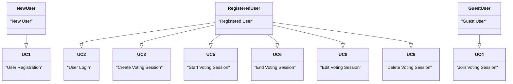


## Softwaredesign
The software itself comprises three areas:
- **Client (C# and XAML)**
- **Client (HTML, CSS and Javascript)**
- **Server (Java, Spring Boot)**

Each of the clients sends data to the server (API), which processes it (updating in database if needed) and sends back a corresponding response. The whole thing can be represented in the architecture as following graphs show:

### Component Diagram
The component diagram below illustrates the high-level architecture of the voting app. It shows how the different clients (desktop and web) communicate with the API server, which uses JDBC to interact with the MongoDB database.

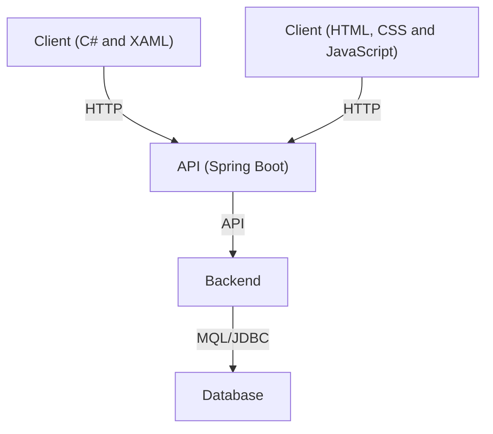
### Sequences
Sequences in the context of the Voting App illustrate the **step-by-step interactions** between the different components **clients**, **API**, and **database**. Each sequence diagram captures a specific user action or system process, detailing the flow of information and communication between the involved entities. The sequences provide insights into how users interact with the application, how data is processed and exchanged, and how the system responds to various scenarios such as successful or failed actions.

#### Sequence 1 - LogIn
The sequence diagram below shows the process of a user logging into the voting app, detailing the interactions between the user, client, API, and database.

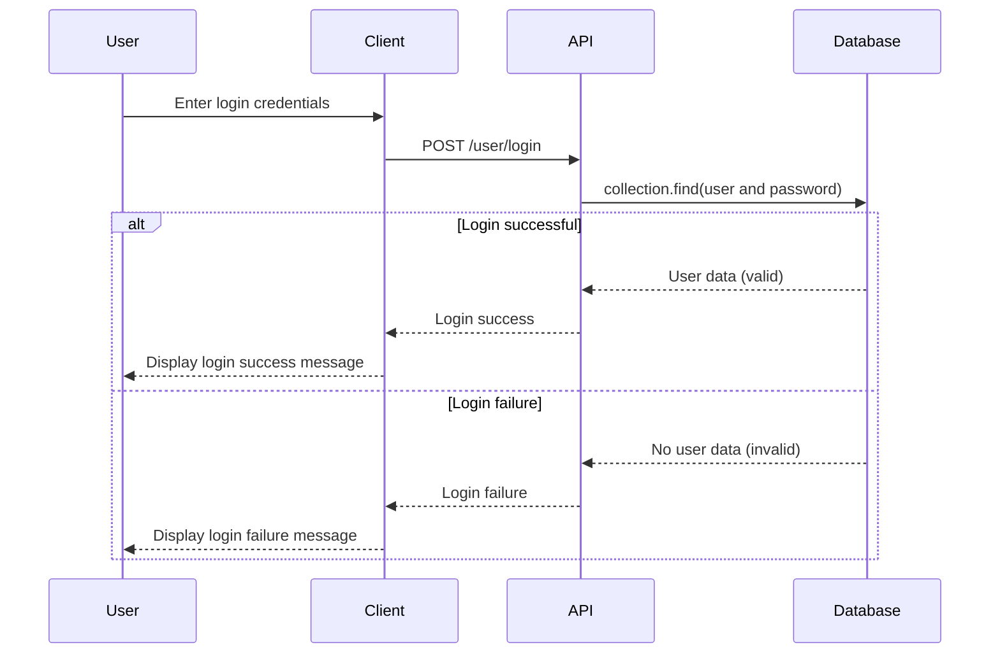

#### Sequence 2 - SignIn
The sequence diagram below depicts the process of a user signing up for the voting app, detailing the interactions between the user, client, API, and database. It includes alternative paths for both successful and unsuccessful signups.

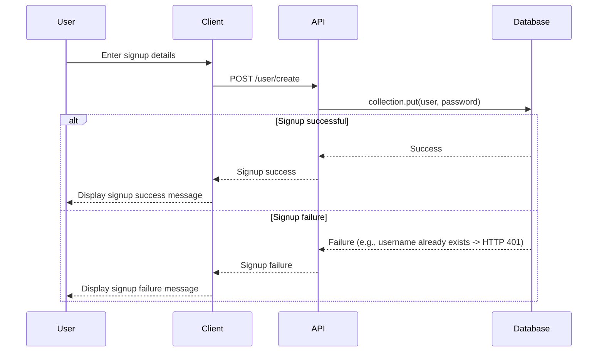
#### Sequence 3 - Create Session
The sequence diagram below illustrates the process of creating a new voting session in the voting app. It outlines the interactions between the user, client, API, and database.

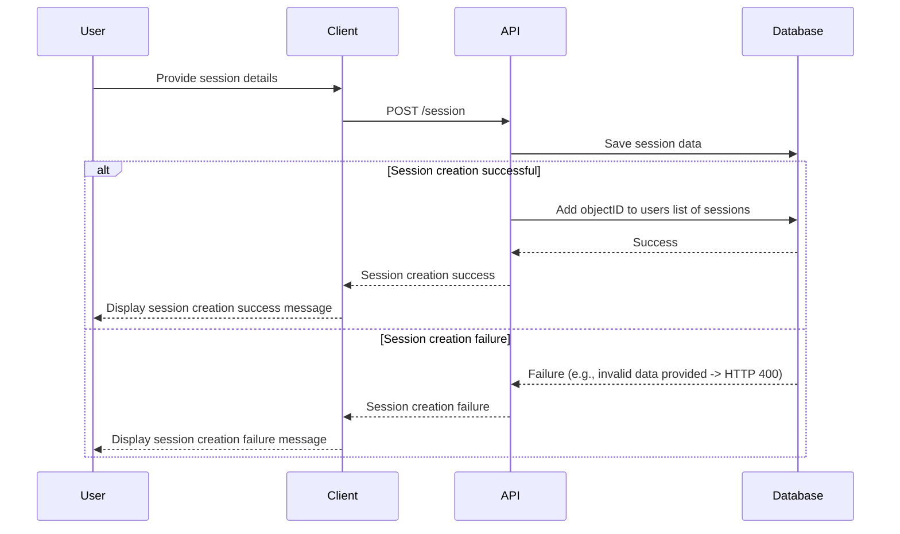

#### Sequence 4 - Update Session
The sequence diagram below demonstrates the process of updating an existing voting session in the voting app. It outlines the interactions between the user, client, API, and database.

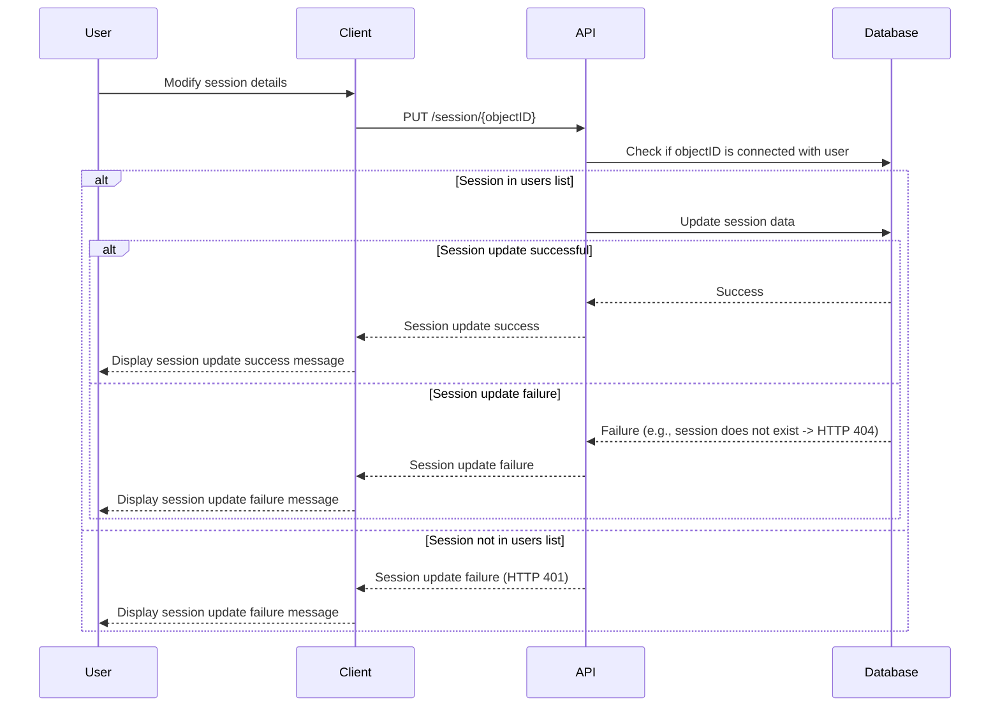

#### Sequence 5 - Start Session
The sequence diagram below illustrates the process of starting a voting session in the voting app. It outlines the interactions between the user, client, API, and database.

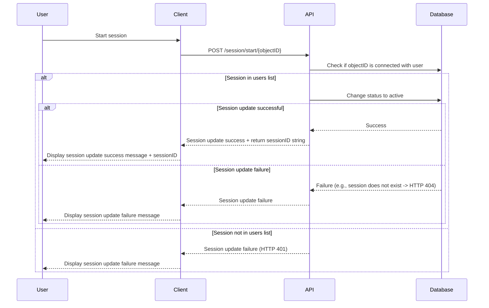

#### Sequence 6 - Join Session
The sequence diagram below demonstrates the process of joining a voting session in the voting app. It outlines the interactions between the user, client, API, and database.

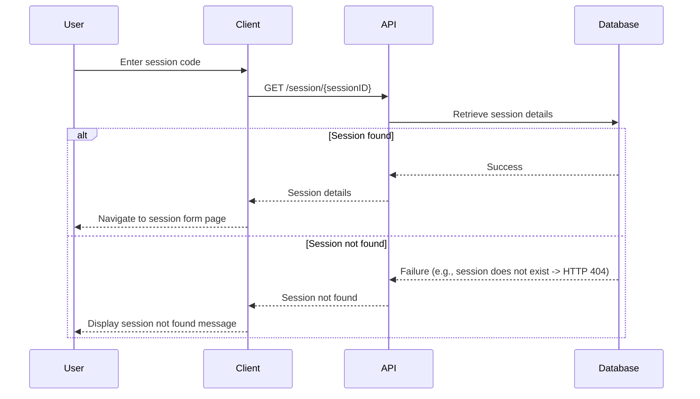

#### Sequence 7 - End Session
The sequence diagram below illustrates the process of ending a voting session in the voting app. It outlines the interactions between the user, client, API, and database.

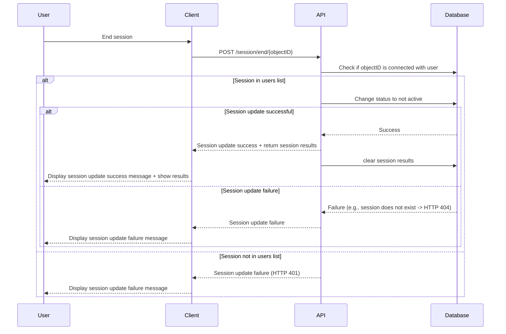

### Activities
#### Activity 1 - Join Session
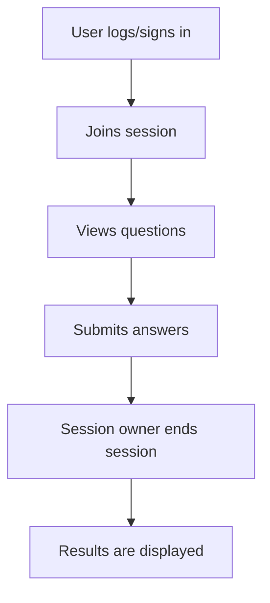
#### Activity 2 - Create and start Session
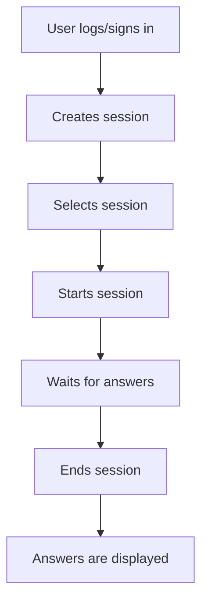
#### Activity 3 - Update Session
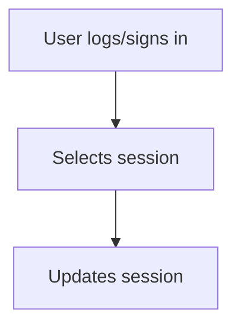

### Class Diagram
The Class Diagrams presents a visual representation of the **data model** underlying the Voting App and its corresponding database structure. This section provides a holistic view of the **various classes**, their **attributes**, and **relationships** within the application. By mapping out the essential components of the system this part offers a comprehensive understanding of how data is organized and manipulated throughout the application's lifecycle.

#### Backend 
This is the way the data is handled and stored in the databse behind the API:

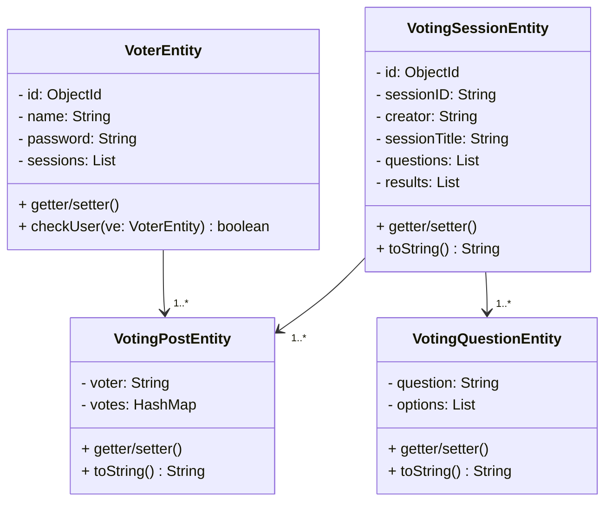

Explanation:
- **VoterEntity Class:** Represents a voter in the application. It contains attributes such as id, name, password, and sessions. Methods include getters and setters for these attributes, as well as checkUser to verify user credentials.

- **VotingPostEntity Class:** Represents a voting post in the application, containing attributes voter and votes. It has methods to get and set these attributes, along with a toString method for string representation.

- **VotingQuestionEntity Class:** Represents a voting question in the application, with attributes question and options. Methods include getters and setters for these attributes, and a toString method for string representation.

- **VotingSessionEntity Class:** Represents a voting session in the application. It contains attributes such as id, sessionID, creator, sessionTitle, questions, and results. Methods include getters and setters for these attributes, along with a toString method for string representation.

Associations:
1. VoterEntity has a **one-to-many** relationship with VotingPostEntity, indicating that a voter can submit multiple voting posts.
2. VotingSessionEntity has **one-to-many** relationships with both VotingQuestionEntity and VotingPostEntity, indicating that a voting session can contain multiple questions and receive multiple voting posts.

#### Clients
The clients do not get all of the information from the server, because it uses **DTOs** (Data Transfer Objects) which let the clients only see the information they need and are allowed to see.

This is the DTO implementation of the server:
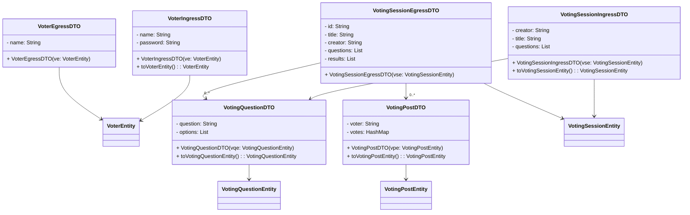

Explanation:
- **VoterExgressDTO:** Represents the data transfer object for a voter entity with only the name attribute used for data sent from the server to the client.
- **VoterIngressDTO:** Represents the data transfer object for a voter entity with name and password attributes used for data sent from the client to the server. It also provides a method to convert the DTO to a VoterEntity.
- **VotingPostDTO:** Represents the data transfer object for a voting post entity, which includes the voter and their votes. It provides a method to convert the DTO to a VotingPostEntity.
- **VotingQuestionDTO:** Represents the data transfer object for a voting question entity, containing the question and options. It provides a method to convert the DTO to a VotingQuestionEntity.
- **VotingSessionExgressDTO:** Represents the data transfer object for a voting session entity with additional fields for questions and results. It is used for data sent from the server to the client.
- **VotingSessionIngressDTO:** Represents the data transfer object for a voting session entity with fields for questions. It is used for data sent from the client to the server. It also provides a method to convert the DTO to a VotingSessionEntity.

These DTOs facilitate the transfer of data between the server and the client in a structured format, helping to maintain a clear separation of concerns and ensuring efficient communication.

### Deployment diagram
The deployment diagram below illustrates the physical deployment of components in the voting app, outlining the distribution of clients, server, and database components across different nodes and their connectivity via the internet.

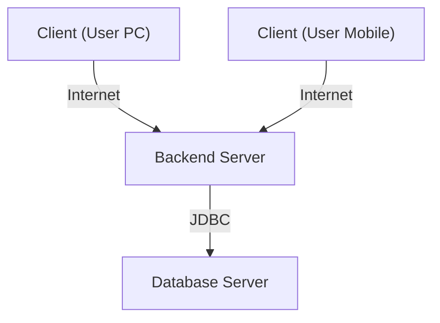

## API
The API documentation provides detailed information on the **endpoints, request/response formats, and functionality** of the voting app's backend API. Due to project reasons this API is not online, still, in future, this section could serve as a guide for developers and integrators to interact with the API and utilize its features effectively.

The API covers two main parts: 
- **User Endpoints**
- **Session Endpoints**

Both serve as an interface between user and the application.

### Base URL
The base URL for accessing the API endpoints is:
- users: **/api/user**
- session: **/api/session** (exact one)
- sessions: **/api/sessions** (one or more)

### Authentication
The API does not currently utilize token-based authentication. Developers can perform actions by sending the user's credentials along with the objectId of the  session. The server verifies whether the session is associated with the user before processing the request.

### Error Handling
The API returns appropriate HTTP status codes and error messages to indicate the success or failure of a request. Detailed error handling ensures clarity in identifying and resolving issues during API interactions.

Possible HTTP status codes:
- **HTTP 200** -> Everything went fine
- **HTTP 400** -> Bad Request (e.g. json format wrong)
- **HTTP 401** -> Unauthorized
- **HTTP 403** -> Forbidden
- **HTTP 404** -> Not Found
- **HTTP 405** -> Method Not Allowed

### Dependencies
In this section, I outline the key dependencies required for the Spring Boot application. Dependencies, usually declared in the **pom.xml** file, are essential libraries and frameworks that the application relies on to function correctly and efficiently. They provide critical functionalities such as database access, web services, security, and more. Understanding and managing these dependencies ensures that the application remains modular, maintainable, and up-to-date with the latest features and security patches. Below, I detail the primary dependencies integrated into the project and their specific roles within the application.

#### Spring Boot MongoDB Dependency
```xml
<dependency>
	<groupId>org.springframework.boot</groupId>
	<artifactId>spring-boot-starter-data-mongodb</artifactId>
</dependency>
```

The **spring-boot-starter-data-mongodb** dependency is a crucial component of the Spring Boot application that enables seamless integration with MongoDB, a popular NoSQL database. This starter provides the necessary tools and configurations to interact with MongoDB databases using Spring Data MongoDB, which simplifies database operations through a repository-based approach. By including this dependency, we gain the ability to:

1. **Leverage MongoDB Repositories:** Easily create and manage MongoDB repositories with minimal boilerplate code.
2. **CRUD Operations:** Perform standard create, read, update, and delete operations on MongoDB collections.
3. **Query Creation:** Utilize a powerful query generation mechanism that supports both method name queries and custom queries using MongoDB's query language.
4. **Configuration Management:** Automatically configure essential MongoDB settings, reducing the need for manual setup.
5. **Template Support:** Access the MongoTemplate class for more advanced and fine-grained database interactions.

This dependency is vital for applications that require efficient, scalable, and flexible data management with MongoDB, ensuring the application can store and retrieve data effectively.

#### Spring Boot Web Dependency
```xml
<dependency>
	<groupId>org.springframework.boot</groupId>
	<artifactId>spring-boot-starter-web</artifactId>
</dependency>
```

The **spring-boot-starter-web** dependency is a fundamental component for building web applications and **RESTful** web services using Spring Boot. This starter includes a comprehensive set of libraries and configurations that streamline the development of web applications. By adding this dependency, we incorporate several key features:

1. **Spring MVC:** Provides robust support for building web applications with the Model-View-Controller (MVC) design pattern, enabling the separation of concerns and clean code organization.
2. **Embedded Servlet Container:** Includes an embedded Tomcat, Jetty, or Undertow server, allowing our application to run as a standalone application without the need for external servers.
3. **RESTful Services:** Simplifies the creation of RESTful web services with built-in support for JSON and XML serialization and deserialization.
4. **Dependency Injection:** Utilizes Spring's powerful dependency injection mechanism to manage application components and their dependencies efficiently.
5. **Error Handling:** Offers comprehensive support for error handling and customized error responses to enhance user experience and debugging.
6. **Validation:** Integrates with Bean Validation (JSR-303) to ensure that web request data is validated and meets specific constraints before processing.

By including the **spring-boot-starter-web** dependency, we ensure that the application is equipped with all the necessary tools and configurations to develop, deploy, and run robust, scalable web applications and services efficiently.

#### Spring Boot Test Dependency
```xml
<dependency>
	<groupId>org.springframework.boot</groupId>
	<artifactId>spring-boot-starter-test</artifactId>
	<scope>test</scope>
</dependency>
```

The **spring-boot-starter-test** dependency is an essential component for writing and running tests in a Spring Boot application. This starter provides a comprehensive suite of tools and libraries designed to support various types of testing, ensuring the application is robust and reliable. By including this dependency, we gain access to:

1. **JUnit 5:** The modern version of JUnit, which is the standard framework for unit testing in Java, offering powerful features for writing and executing tests.
2. **Spring TestContext Framework:** Simplifies integration testing by providing a way to load and configure an application context for tests, allowing us to test components in isolation or as part of the full application.
3. **Mocking Libraries:** Integrates with Mockito and other libraries to facilitate the creation of mock objects, enabling us to isolate the code under test and simulate different scenarios.
4. **AssertJ:** Provides a fluent and powerful assertion library to write readable and maintainable test assertions.
5. **Hamcrest:** Offers a library of matchers that can be used to create flexible and readable test assertions.
6. **JSONPath:** Allows for easy extraction and assertion of values from JSON documents, useful for testing RESTful web services.
7. **Spring Boot Test Utilities:** Includes various utilities and annotations to streamline testing Spring Boot applications, such as **@SpringBootTest**, **@WebMvcTest**, and **@DataJpaTest**.

The **<scope>test</scope>** element specifies that this dependency is only needed for the testing phase and will not be included in the final build of the application. This helps keep the production environment clean and efficient.

By including the **spring-boot-starter-test** dependency, we ensure the application can be thoroughly tested, from unit tests to integration tests, promoting high code quality and reliability.

### Endpoints
The API exposes various endpoints to perform actions such as **creating sessions, creating users, and posting voting data**. Each endpoint is documented with its purpose, request method, parameters, and response format, additionally showing the java implementation of the endpoint in the API-Controller.

Refer to the following sections for detailed documentation on specific endpoints:

#### Health Endpoint:
Endpoint for debugging reasons that returns "UP" if the server is running and good to go.
<details>
<summary><code>GET</code> <code><b>/api/status</b></code></summary>

##### Responses

> | http code     | content-type                      | response                                                            |
> |---------------|-----------------------------------|---------------------------------------------------------------------|
> | `200`         | `application/json`        | `server status `                                |

##### Example cURL

> ```javascript
>  curl -X GET -H "Content-Type: application/json" --data http://localhost:5010/api/status
> ```

##### Java
```java
@GetMapping("status")
    public ResponseEntity<String> health() {
        return ResponseEntity.ok("UP");
    }
```
</details>

#### User Endpoints
Endpoints that expose routes for handling the voting app users, including the **login** with an existing user and **creating** a new user.
##### Sign up with new user
<details>
<summary><code>POST</code> <code><b>/api/user/create</b></code></summary>

##### Parameters

> | name      |  type     | data type               | description                                                           |
> |-----------|-----------|-------------------------|-----------------------------------------------------------------------|
> | None      |  required | object (JSON)   | user data  |


##### Responses

> | http code     | content-type                      | response                                                            |
> |---------------|-----------------------------------|---------------------------------------------------------------------|
> | `200`         | `application/json`        | `User object `                                |
> | `400`         | `application/json`                | `{"code":"400","message":"Bad Request"}`                            |
> | `409`         | `application/json`         | `{"code":"409","message":"Conflict"}`                                                                |

##### Example cURL

> ```javascript
>  curl -X POST -H "Content-Type: application/json" --data @post.json http://localhost:5010/api/user/create
> ```

##### Java
```java
@PostMapping("user/create")
    public ResponseEntity<VoterIngressDTO> signUp(@RequestBody VoterIngressDTO voterIngressDTO) {
        try {
            boolean tmp = userService.addUser(voterIngressDTO.toVoterEntity());
            if(!tmp)
                return ResponseEntity.status(HttpStatus.CONFLICT).build();
            return ResponseEntity.ok(voterIngressDTO);
        }
        catch(Exception e) {
            return ResponseEntity.status(HttpStatus.BAD_REQUEST).build();
        }
    }
```
</details>

##### Log in with existing user
<details>
<summary><code>POST</code> <code><b>/api/user/login</b></code></summary>

##### Parameters

> | name      |  type     | data type               | description                                                           |
> |-----------|-----------|-------------------------|-----------------------------------------------------------------------|
> | None      |  required | object (JSON)   | user data  |


##### Responses

> | http code     | content-type                      | response                                                            |
> |---------------|-----------------------------------|---------------------------------------------------------------------|
> | `200`         | `application/json`        | `User object `                                |
> | `400`         | `application/json`                | `{"code":"400","message":"Bad Request"}`                            |
> | `401`         | `application/json`         | `{"code":"401","message":"Unathorized"}`                                                                |

##### Example cURL

> ```javascript
>  curl -X POST -H "Content-Type: application/json" --data @post.json http://localhost:5010/api/user/login
> ```

##### Java
```java
@PostMapping("user/login")
    public ResponseEntity<VoterIngressDTO> login(@RequestBody VoterIngressDTO voterIngressDTO) {
        try {
            VoterEntity tmp = userService.checkUser(voterIngressDTO.toVoterEntity());
            if(tmp == null)
                return ResponseEntity.status(HttpStatus.UNAUTHORIZED).build();
            return ResponseEntity.ok(voterIngressDTO);
        }
        catch(Exception e) {
            return ResponseEntity.status(HttpStatus.BAD_REQUEST).build();
        }
    }
```
</details>

#### Session endpoints
Endpoints that handle everything around sessions:
##### Create a new session
<details>
<summary><code>POST</code> <code><b>/api/session</b></code></summary>

##### Parameters

> | name      |  type     | data type               | description                                                           |
> |-----------|-----------|-------------------------|-----------------------------------------------------------------------|
> | None      |  required | object (JSON)   | user data + session data  |


##### Responses

> | http code     | content-type                      | response                                                            |
> |---------------|-----------------------------------|---------------------------------------------------------------------|
> | `200`         | `text/plain;charset=UTF-8`         | `Object ID of posted session `                                |
> | `400`         | `application/json`                | `{"code":"400","message":"Bad Request"}`                            |
> | `401`         | `application/json`         | `{"code":"401","message":"Unathorized"}`                                                                |

##### Example cURL

> ```javascript
>  curl -X POST -H "Content-Type: application/json" --data @post.json http://localhost:5010/api/session
> ```

##### Java
```java
@PostMapping("session")
    public ResponseEntity<String> createVotingSession(@RequestBody HttpPostRequest httpRequest) {
        try {
            ObjectId tmp = votingSessionService.create(httpRequest.getVotingSessionDTO(), httpRequest.getVoterDTO());
            if(tmp == null)
                return ResponseEntity.status(HttpStatus.UNAUTHORIZED).build();
            return ResponseEntity.ok(tmp.toString());
        }
        catch(Exception e) {
            System.out.println(e);
            return ResponseEntity.status(HttpStatus.BAD_REQUEST).build();
        }
    }
```
</details>

##### Start an existing session
<details>
<summary><code>POST</code> <code><b>/api/session/start/{id}</b></code></summary>

##### Path variables

> | name      |  type     | data type               | description                                                           |
> |-----------|-----------|-------------------------|-----------------------------------------------------------------------|
> | None      |  required | text   | object id of specific session  |

##### Parameters

> | name      |  type     | data type               | description                                                           |
> |-----------|-----------|-------------------------|-----------------------------------------------------------------------|
> | None      |  required | object (JSON)   | user data  |


##### Responses

> | http code     | content-type                      | response                                                            |
> |---------------|-----------------------------------|---------------------------------------------------------------------|
> | `200`         | `text/plain;charset=UTF-8`         | `Object ID of posted session `                                |
> | `400`         | `application/json`                | `{"code":"400","message":"Bad Request"}`                            |
> | `401`         | `application/json`         | `{"code":"401","message":"Unathorized"}`                                                                |

##### Example cURL

> ```javascript
>  curl -X POST -H "Content-Type: application/json" --data @post.json http://localhost:5010/api/session/start/892134812409324
> ```

##### Java
```java
@PostMapping("session/start/{id}")
    public ResponseEntity<String> startVotingSession(@PathVariable String id, @RequestBody VoterIngressDTO voterIngressDTO) {
        try {
            String tmp = votingSessionService.startSession(new ObjectId(id), voterIngressDTO);
            System.out.println(tmp);
            if(tmp == null)
                return ResponseEntity.status(HttpStatus.UNAUTHORIZED).build();
            return ResponseEntity.ok(tmp);
        }
        catch(Exception e) {
            System.out.println(e);
            return ResponseEntity.status(HttpStatus.BAD_REQUEST).build();
        }
    }
```
</details>

##### End an existing session
<details>
<summary><code>POST</code> <code><b>/api/session/end/{id}</b></code></summary>

##### Path variables

> | name      |  type     | data type               | description                                                           |
> |-----------|-----------|-------------------------|-----------------------------------------------------------------------|
> | None      |  required | text   | object id of specific session  |

##### Parameters

> | name      |  type     | data type               | description                                                           |
> |-----------|-----------|-------------------------|-----------------------------------------------------------------------|
> | None      |  required | object (JSON)   | user data  |


##### Responses

> | http code     | content-type                      | response                                                            |
> |---------------|-----------------------------------|---------------------------------------------------------------------|
> | `200`         | `application/json`         | ` Session object with results `                                |
> | `400`         | `application/json`                | `{"code":"400","message":"Bad Request"}`                            |
> | `401`         | `application/json`         | `{"code":"401","message":"Unathorized"}`                                                                |

##### Example cURL

> ```javascript
>  curl -X POST -H "Content-Type: application/json" --data @post.json http://localhost:5010/api/session/end/892134812409324
> ```

##### Java
```java
    @PostMapping("session/end/{id}")
    public ResponseEntity<VotingSessionExgressDTO> endSession(@PathVariable String id, @RequestBody VoterIngressDTO voterIngressDTO) {
        try {
            VotingSessionExgressDTO tmp = votingSessionService.endSession(new ObjectId(id), voterIngressDTO);
            if(tmp == null)
                return ResponseEntity.status(HttpStatus.UNAUTHORIZED).build();
            System.out.println(tmp);
            return ResponseEntity.ok(tmp);
        }
        catch(Exception e) {
            System.out.println(e);
            return ResponseEntity.status(HttpStatus.BAD_REQUEST).build();
        }
    }
```
</details>

##### Post answers to a session
<details>
<summary><code>POST</code> <code><b>/api/session/results/{sessionId}</b></code></summary>

##### Path variables

> | name      |  type     | data type               | description                                                           |
> |-----------|-----------|-------------------------|-----------------------------------------------------------------------|
> | None      |  required | text   | session id of specific session  |

##### Parameters

> | name      |  type     | data type               | description                                                           |
> |-----------|-----------|-------------------------|-----------------------------------------------------------------------|
> | None      |  required | object (JSON)   | results  |


##### Responses

> | http code     | content-type                      | response                                                            |
> |---------------|-----------------------------------|---------------------------------------------------------------------|
> | `200`         | `application/json`         | ` posted answers `                                |
> | `404`         | `application/json`                | `{"code":"404","message":"Not Found"}`                            |
> | `401`         | `application/json`         | `{"code":"401","message":"Unathorized"}`                                                                |

##### Example cURL

> ```javascript
>  curl -X POST -H "Content-Type: application/json" --data @post.json http://localhost:5010/api/session/results/ABCDEF
> ```

##### Java
```java
    @PostMapping("session/results/{sessionID}")
    public ResponseEntity<VotingPostDTO> postResults(@PathVariable String sessionID, @RequestBody VotingPostDTO votingPostDTO) {
        try {
            VotingSessionExgressDTO votingSessionExgressDTO = votingSessionService.read(sessionID);
            if (votingSessionExgressDTO == null) return ResponseEntity.status(HttpStatus.NOT_FOUND).build();
            return ResponseEntity.ok(votingSessionService.postResults(sessionID, votingPostDTO));
        }
        catch(Exception e) {
            System.out.println(e);
            return ResponseEntity.status(HttpStatus.BAD_REQUEST).build();
        }
    }
```
</details>

##### Fetch all sessions for a user
<details>
<summary><code>POST</code> <code><b>/sessions/user</b></code></summary>

##### Parameters

> | name      |  type     | data type               | description                                                           |
> |-----------|-----------|-------------------------|-----------------------------------------------------------------------|
> | None      |  required | object (JSON)   | user data  |


##### Responses

> | http code     | content-type                      | response                                                            |
> |---------------|-----------------------------------|---------------------------------------------------------------------|
> | `200`         | `application/json`         | ` list of sessions for the user `                                |                            |
> | `401`         | `application/json`         | `{"code":"401","message":"Unathorized"}`                                                                |

##### Example cURL

> ```javascript
>  curl -X POST -H "Content-Type: application/json" --data @post.json http://localhost:5010/api/sessions/user
> ```

##### Java

```java
    @PostMapping("sessions/user")
    public ResponseEntity<List<VotingSessionExgressDTO>> readUserSessions(@RequestBody VoterIngressDTO voterIngressDTO) {
        List<VotingSessionExgressDTO> votingSessionExgressDTOs = votingSessionService.readAllByUser(voterIngressDTO);
        if (votingSessionExgressDTOs == null) return ResponseEntity.status(HttpStatus.UNAUTHORIZED).build();
        return ResponseEntity.ok(votingSessionExgressDTOs);
    }
```
</details>

##### Fetch a specific session (join a session)
<details>
<summary><code>GET</code> <code><b>/api/session/{sessionId}</b></code></summary>

##### Path variables

> | name      |  type     | data type               | description                                                           |
> |-----------|-----------|-------------------------|-----------------------------------------------------------------------|
> | None      |  required | text   | session id of specific session  |

##### Responses

> | http code     | content-type                      | response                                                            |
> |---------------|-----------------------------------|---------------------------------------------------------------------|
> | `200`         | `application/json`         | ` session object `                                |                            |
> | `404`         | `application/json`         | `{"code":"404","message":"Not Found"}`                                                                |

##### Example cURL

> ```javascript
>  curl -X POST -H "Content-Type: application/json" --data @post.json http://localhost:5010/api/session
> ```

##### Java

```java
    @GetMapping("session/{sessionId}")
    public ResponseEntity<VotingSessionExgressDTO> readVotingSession(@PathVariable String id) {
        VotingSessionExgressDTO votingSessionExgressDTO = votingSessionService.read(id);
        if (votingSessionExgressDTO == null) return ResponseEntity.status(HttpStatus.NOT_FOUND).build();
        return ResponseEntity.ok(votingSessionExgressDTO);
    }
```
</details>

##### Delete a specific session
<details>
<summary><code>DELETE</code> <code><b>/api/session/{id}</b></code></summary>

##### Path variables

> | name      |  type     | data type               | description                                                           |
> |-----------|-----------|-------------------------|-----------------------------------------------------------------------|
> | None      |  required | text   | object id of a specific session  |

##### Parameters

> | name      |  type     | data type               | description                                                           |
> |-----------|-----------|-------------------------|-----------------------------------------------------------------------|
> | None      |  required | object (JSON)   | user data  |

##### Responses

> | http code     | content-type                      | response                                                            |
> |---------------|-----------------------------------|---------------------------------------------------------------------|
> | `200`         | `application/json`         | ` true/false `                                |                            |
> | `401`         | `application/json`         | `{"code":"401","message":"Aunathorized"}`                                                                |

##### Example cURL

> ```javascript
>  curl -X DELETE -H "Content-Type: application/json" http://localhost:5010/api/session/892134812409324
> ```

##### Java

```java
    @DeleteMapping("session/{id}")
    public ResponseEntity<Boolean> deleteVotingSession(@PathVariable String id, @RequestBody VoterIngressDTO voterIngressDTO) {
        boolean tmp = votingSessionService.delete(new ObjectId(id), voterIngressDTO.toVoterEntity());
        if (!tmp) return ResponseEntity.status(HttpStatus.UNAUTHORIZED).build(); // session id is not in users list
        return ResponseEntity.ok(tmp);
    }
```
</details>

##### Delete all sessions in the repository
<details>
<summary><code>DELETE</code> <code><b>/api/sessions</b></code></summary>


##### Responses

> | http code     | content-type                      | response                                                            |
> |---------------|-----------------------------------|---------------------------------------------------------------------|
> | `200`         | `application/json`         | ` amount of deleted sessions `                                |                            |                                                             |

##### Example cURL

> ```javascript
>  curl -X DELETE -H "Content-Type: application/json" http://localhost:5010/api/sessions
> ```

##### Java

```java
    @DeleteMapping("sessions")
    public ResponseEntity<Long> deleteVotingSessions() {
        return ResponseEntity.ok(votingSessionService.deleteAll());
    }
```
</details>

##### Update an existing session
<details>
<summary><code>PUT</code> <code><b>/api/session/{id}</b></code></summary>

##### Path variables

> | name      |  type     | data type               | description                                                           |
> |-----------|-----------|-------------------------|-----------------------------------------------------------------------|
> | None      |  required | text   | object id of a specific session  |

##### Parameters

> | name      |  type     | data type               | description                                                           |
> |-----------|-----------|-------------------------|-----------------------------------------------------------------------|
> | None      |  required | object (JSON)   | updated session data  |

##### Responses

> | http code     | content-type                      | response                                                            |
> |---------------|-----------------------------------|---------------------------------------------------------------------|
> | `200`         | `application/json`         | ` updated session data + user data `                                |                            |                                                             |

##### Example cURL

> ```javascript
>  curl -X PUT -H "Content-Type: application/json" --data @post.json http://localhost:5010/api/session/892134812409324
> ```

##### Java

```java
    @PutMapping("session/{id}")
    public  ResponseEntity<HttpPostRequest> updateVotingSession(@PathVariable String id, @RequestBody HttpPostRequest httpPostRequest) {
        try {
            boolean tmp = votingSessionService.update(new ObjectId(id), httpPostRequest.getVotingSessionDTO().toVotingSessionEntity(),
                    httpPostRequest.getVoterDTO().toVoterEntity());
            if (!tmp) return ResponseEntity.status(HttpStatus.UNAUTHORIZED).build(); // session id is not in users list
            return ResponseEntity.ok(httpPostRequest);
        }
        catch(Exception e) {
            return ResponseEntity.status(HttpStatus.BAD_REQUEST).build();
        }
    }
```
</details>

### How to use 
To use the API just take a hit at the endpoints and communicate with the application backend. You might want to change some internal configuration following:

#### MongoDB Configuration
This section provides documentation for configuring MongoDB in the Spring Boot application. The configuration class MongoDBConfiguration sets up the MongoDB client using properties defined in the application's configuration file.

Configuration Class
The MongoDBConfiguration class is annotated with **@Configuration**, indicating that it defines beans for the Spring application context.

```java
@Configuration
public class MongoDBConfiguration {

    @Value("${spring.data.mongodb.uri}")
    private String connectionString;

    @Bean
    public MongoClient mongoClient() {
        CodecRegistry pojoCodecRegistry = fromProviders(PojoCodecProvider.builder().automatic(true).build());
        CodecRegistry codecRegistry = fromRegistries(MongoClientSettings.getDefaultCodecRegistry(), pojoCodecRegistry);
        return MongoClients.create(MongoClientSettings.builder()
                .applyConnectionString(new ConnectionString(connectionString))
                .codecRegistry(codecRegistry)
                .build());
    }

}
```
##### Explanation
###### Annotations
- **@Configuration**: Indicates that this class contains one or more bean methods that will be managed by the Spring container.
- **@Value("${spring.data.mongodb.uri}")**: Injects the MongoDB URI from the application's properties file into the connectionString variable.

##### Fields
- **java private String connectionString;**: Stores the MongoDB connection string retrieved from the application properties.

Methods
- **@Bean public MongoClient mongoClient()**: Defines a MongoClient bean that will be managed by the Spring container.

Bean Creation
1. CodecRegistry Setup:
    - **CodecRegistry pojoCodecRegistry**: Configures a codec registry that automatically handles POJOs.
    - **CodecRegistry codecRegistry**: Combines the default codec registry with the POJO codec registry.

2. MongoClient Creation:
    - **MongoClients.create(MongoClientSettings.builder()...)**: Creates a MongoClient using the specified settings.
    - **applyConnectionString(new ConnectionString(connectionString))**: Applies the MongoDB connection string.
    - **codecRegistry(codecRegistry)**: Sets the custom codec registry.

Configuration Properties
- Ensure that the MongoDB connection string is specified in your application.properties or application.yml file:

**application.properties:**
```properties
spring.data.mongodb.uri=mongodb://localhost:27017/yourdatabase
```

**application.yml:**
```yaml
spring:
data:
    mongodb:
    uri: mongodb://localhost:27017/yourdatabase
```

##### Usage
By defining this configuration, the Spring Boot application will automatically use the configured MongoClient bean to interact with MongoDB. This setup enables the application to handle MongoDB operations with a properly configured connection and codec registry for POJOs.

##### Summary
The MongoDBConfiguration class provides a way to configure and customize the MongoDB client for the Spring Boot application, ensuring that the application can connect to MongoDB and handle POJOs correctly. This configuration is essential for applications that need to interact with MongoDB in a type-safe and efficient manner.

#### Web Configuration
This section provides documentation for configuring web-related settings in the Spring Boot application. The WebConfiguration class enables Spring's Web MVC framework and configures **Cross-Origin Resource Sharing** (CORS) settings.

##### Configuration Class
The WebConfiguration class is annotated with **@Configuration** and **@EnableWebMvc**, indicating that it defines beans for the Spring application context and enables Web MVC.

```java
@Configuration
@EnableWebMvc
public class WebConfiguration implements WebMvcConfigurer {

    @Override
    public void addCorsMappings(CorsRegistry registry) {
        registry.addMapping("/**")
                .allowedOrigins("*")
                .allowedMethods("GET", "POST", "PUT", "DELETE")
                .allowedHeaders("*");
    }
}
```

##### Explanation

Annotations
- **@Configuration:** Indicates that this class contains one or more bean methods to be managed by the Spring container.
- **@EnableWebMvc:** Enables Spring's Web MVC support and configuration.

Implementation
- **public class WebConfiguration implements WebMvcConfigurer:** Implements the WebMvcConfigurer interface to customize the configuration for Spring Web MVC.

Methods
- **@Override public void addCorsMappings(CorsRegistry registry):** Configures CORS mappings.

CORS Configuration
1. addCorsMappings(CorsRegistry registry):
    - **registry.addMapping("/"):** Applies CORS configuration to all endpoints.
    - **allowedOrigins("*"):** Allows requests from any origin.
    - **allowedMethods("GET", "POST", "PUT", "DELETE"):** Allows specified HTTP methods.
    - **allowedHeaders("*"):** Allows any headers in CORS requests.

##### CORS Configuration Properties
This configuration allows the application to accept requests from any origin, which can be useful during development. However, for production environments, you may want to restrict allowed origins to trusted domains.

##### Usage
By defining this configuration, the Spring Boot application will automatically apply the specified CORS settings to all endpoints. This setup is essential for enabling cross-origin requests.

##### Summary
The WebConfiguration class provides a way to configure web-related settings, particularly CORS, for the Spring Boot application. By enabling CORS with permissive settings, it allows the application to accept cross-origin requests, facilitating frontend-backend communication in a decoupled architecture. This configuration is crucial for enabling seamless interaction between different parts of the application.

## Discussion
### Summary
The project for the second term of the HTL Saalfelden for computer science is finished and provides a functional voting application including:
- WPF Client
- Web Client
- Spring Boot Server

, which together form a distributed system that can be seen by users as a simply way to initiate voting sessions. For instance, it can be established as some sort of fast gathering mechanism for opinions in schools, companies, etc...

### Background
The reason for me tho choose a voting app as my project is as simple as it sounds: interest. I thought it would be interesting to create an application like kahoot for web and desktop. Additionally it is not something that is finished and used for once. No, the project is free to go for innovations and updates and is surely something that brings a use for many people.

### Future
As I have already stated above, it is very likely there will be updates in the future. The application is build in an architecture that allows fast and easy extensions. 

Possible extensions might be:
- User log out mechanismn
- Update user mechanismn
- Option to activate time limit for sessions
- Possibility for users to provide own answers
- Possibility for sessions to include images and/or audio files

## Links
This section contains various tools that were used to create the application or at least helped at it:

### IDEs
- Microsoft Visual Studio 2022: https://visualstudio.microsoft.com/de/downloads/
- Microsoft Visual Studio Code 1.89.1: https://code.visualstudio.com/download
- IntelliJ 2022.2.1: https://www.jetbrains.com/idea/download/?section=windows

### Technology
- Spring Boot: https://spring.io/projects/spring-boot
- C#
- HTML5, CSS, Java Script
- Markdown Preview Mermaid Support 1.23.0: https://marketplace.visualstudio.com/items?itemName=bierner.markdown-mermaid

### Debugging
- Postman 11.1.14: https://www.postman.com/downloads/
